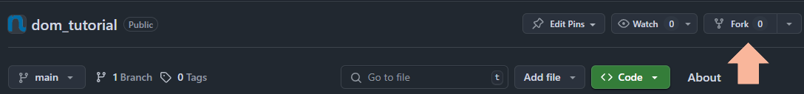
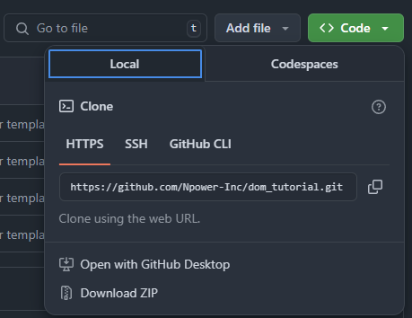

# Path2Tech DOM Tutorial

This repository will help guide you on getting familiar with using the Document Object Model

## Prerequisites
- Visual Studio Code Installed
- Live Server Extension Installed


## Installing Project
1. Please make sure to fork this repository to your personal GitHub. You will find the button to fork this repository near the top right part of the screen.



Press this button and on the next screen it will give you the option to fork the repository make sure to click the green button title "Create fork" to fork the repositoy to your own GitHub

2. Clone the repository to your machine, to do this open a new terminal and run

```sh
https://github.com/<github_repo_owner>/<github_repo_name>.git
```

To get the GitHub URL to clone the repo click on the green button title "<> Code" this will open a dropdown and you can copy the URL to clone this git repository to your system.



## Getting Started

1. After installing your project, open it in Visual Studio Code, open the `index.html` file and use the live server extension to start the project up

2. After the project has been started you can edit the `index.html`, `styles.css`, and `app.js` code files to be able to change the output of your web application.

## Final Notes
If you followed all the steps above correctly your environment should be set up, if there are issues you will need to go back and fix them.